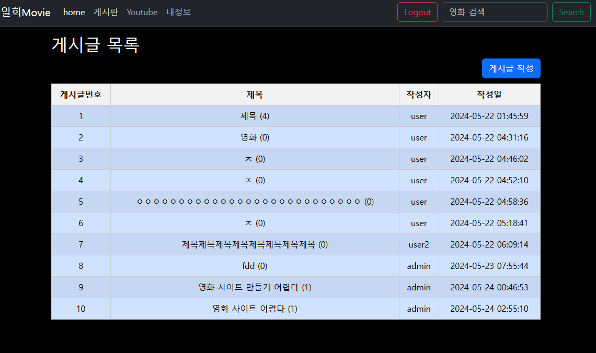

[](https://github.com/anuraghazra/github-readme-stats)

# Project

, , , ,
, 

1. 영화 추천 알고리즘 사이트 만들기
* 일희무비
    * , 	, , 을 사용하였습니다.
    * 영화 api를 TMDB에서 받아와서 제작
        * axios를 이용하여 데이터를 받아오고 받아온 데이터에서 description을 기반으로 현재 선택한 영화와 유사한 영화를 추천해주는 알고리즘을 텍스트 유사도 함수를 이용하여 구현했다.
```py


```
    

당시 프로젝트 이름은 일희movie로 지었는데, 별 뜻은 없고 팀원분하고 마지막까지 못 지어서 이름 한 글자씩 합쳐서 지었다.





최근 완료 후 ui가 너무 기능 중심인 것 같아 수정 중이다.
* 백, 프론트 구분없이 협업.
* AI 연결 진행


2. 학생들의 문해력 향상을 위한 학습 게임 만들기
    * , 
    * 프론트 담당
    * 초기 다들 게임 개발은 처음이라 시도하던 중, three.js를 너무 잘 해서 게임 개발 담당으로 정해졌습니다.
        * 담당이 된 후 sketchfab에서 표기할 경우 상업적으로도 사용이 가능한 캐릭터들 중 애니메이션을 가진 캐릭터들을 선별하였고, 그 중 하나를 임포트 하여 개발을 시작하였습니다.
병아리
고양이
쥐
....
링크


